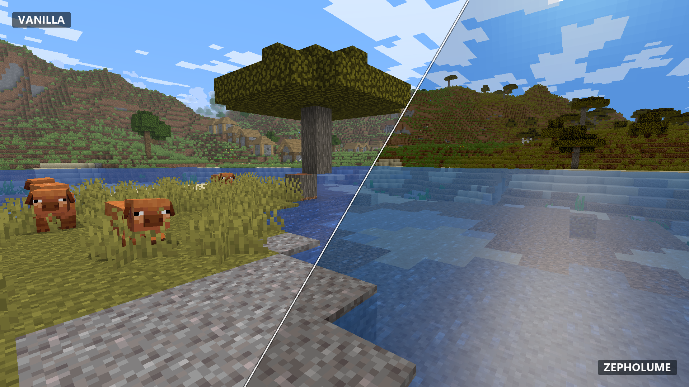

# Zepholume Shaders

**Atmospheric lighting. Polished visuals. Practical performance.**

Zepholume Shaders is a performance-conscious shader pack for **Minecraft Java Edition**. It is built to make Minecraft feel richer, deeper, and more atmospheric without treating frame rate as disposable.



## Current release

**Zepholume Shaders V1.0.3**  
Release archive: [`Zepholume-Shaders-1.0.3.zip`](Releases/Zepholume-Shaders-1.0.3.zip)

V1.0.3 keeps Minecraft **1.20.1** as the staged runtime-validation baseline and also carries static compatibility lanes for Minecraft **26.2**. Those lanes do not all have the same evidence level.

Prepared/stated environments currently include:

- **Minecraft 1.20.1 + Iris 1.7.6 + Sodium 0.5.13 + Java 17** — staged locally; static validation passes
- **Minecraft 1.20.1 + Forge 47.4.22 + Oculus 1.8.0 + Embeddium 0.3.31 + Java 17** — staged locally; static validation passes
- **Minecraft 26.2 + Iris 1.11.2 on Fabric or NeoForge** — static target only; runtime not yet qualified
- **Minecraft 26.2 + Forge 65.1.0 + Oculus Community Port 0.3.0-beta.1** — experimental and currently blocked for Zepholume's ordinary `gbuffers_*` world programs by the port's declared partial program support

> Static GLSL validation, staged files, and mathematical regression tests do **not** prove loader-patched compilation, shader activation, real-GPU rendering, visual parity, FPS, or cross-vendor behaviour. Runtime qualification remains a separate requirement.

OptiFine is not a supported target for Zepholume.

## What's new in V1.0.3

V1.0.3 is a correctness, visual-refinement, and hardening release. It improves the existing direct-path renderer rather than bolting on a heavyweight post-processing stack.

Highlights include:

- removed the active water fragment path's redundant working-space encode/decode round trip
- restored exact Hermite `smoothstep` behaviour for skylight gating and block-light warmth while retaining named compile-time reciprocal range constants
- added skylight occlusion for downward-facing facets and partial overhangs on Balanced, High, and Ultra
- added dual-hemisphere ambient irradiance on High and Ultra, combining cool sky-dome fill with restrained warm ground bounce
- refined High and Ultra water to a fifth-power Fresnel-Schlick-shaped response while lower water tiers retain the V1.0.2 fourth-power artistic curve
- added top-facet solar rim highlighting to clouds on High and Ultra
- removed unreachable fog-scattering and foliage-response branches instead of carrying dead profile code
- expanded deterministic mathematical regression tests and evidence-scoped compatibility/benchmark documentation

No FPS uplift is claimed without controlled runtime benchmarking. Static shader complexity, source cleanup, and mathematical equivalence are useful engineering evidence; they are not gameplay benchmarks wearing fake moustaches.

## What Zepholume focuses on

- Atmospheric lighting and environmental colour
- Controlled exposure, contrast, temperature, and scene depth
- Refined fog, sky, cloud, weather, water, and underwater treatment
- Multiple quality profiles with real compile-time capability boundaries
- Stable frame pacing and bounded rendering cost
- A deliberately maintainable shared-GLSL architecture
- Broad GLSL portability rather than vendor-specific tricks

Zepholume does **not** chase a feature checklist at any cost. The rendering design stays intentionally lean: no shadow-map pipeline, SSR, SSAO, bloom pipeline, temporal history/TAA, volumetric pipeline, ray tracing, compute shaders, geometry/tessellation stages, SSBO/image pipeline, or a pile of extra full-resolution colour buffers.

## Quality profiles

| Profile | Intended use | Direct-path behaviour |
| --- | --- | --- |
| **Potato** | Weak/integrated GPUs and compatibility triage | Direct grade and loader sky/fog; analytical face/material/cloud/water/weather/underwater-colour work compiled out |
| **Low** | Lower-end hardware | Directional face/cloud response, bounded analytical water/weather, subtle underwater fog tint |
| **Balanced** | General gameplay | Default; adds stronger material response, atmospheric depth, two-wave water movement, and V1.0.3 skylight occlusion for downward/overhung facets |
| **High** | Systems with more headroom | Adds higher bounded detail, dual-hemisphere ambient fill, refined fifth-power water response, and cloud solar-rim treatment |
| **Ultra** | Maximum current Zepholume quality | Maximum bounded analytical tiers within the same direct-path architecture; still no shadow/post/temporal renderer expansion |

`Balanced` is the default and recommended starting point. `Ultra Lite` remains a deprecated compatibility alias for Low. See [Profiles](docs/PROFILES.md).

## Installation

1. For the strongest current evidence baseline, use a **Minecraft 1.20.1** instance with the staged Iris or Oculus stack documented above.
2. Download [`Zepholume-Shaders-1.0.3.zip`](Releases/Zepholume-Shaders-1.0.3.zip).
3. Put the ZIP directly in that instance's `shaderpacks` folder.
4. Open Minecraft's shader-pack menu and select **Zepholume Shaders**.
5. Start with the **Balanced** profile, then tune down or up for your hardware.

Do not extract the release ZIP. For compatibility testing, prefer a disposable or isolated instance over an irreplaceable modpack save.

Minecraft 26.2 lanes are currently **static/experimental evidence**, not equivalent to the staged 1.20.1 baseline. See the compatibility documentation before treating them as supported runtime configurations.

Full instructions: [Installation Guide](docs/INSTALLATION.md)

## Compatibility and validation status

V1.0.3 has strong **static/source and numerical regression validation** but incomplete **runtime qualification**.

The maintained source pipeline validates profile/dimension behaviour, standalone GLSL compilation, architectural boundaries, and release-specific mathematical invariants. That can catch source, preprocessor, interface, arithmetic, and architecture regressions; it cannot establish loader-patched compilation, driver behaviour, visual correctness, or measured performance.

See [Compatibility](docs/COMPATIBILITY.md) for the public compatibility boundary.

## Documentation

- [Installation](docs/INSTALLATION.md)
- [Compatibility](docs/COMPATIBILITY.md)
- [Quality Profiles](docs/PROFILES.md)
- [Architecture](docs/ARCHITECTURE.md)
- [Troubleshooting](docs/TROUBLESHOOTING.md)
- [Development](docs/DEVELOPMENT.md)
- [Shader source and developer tooling](Zepholume-Shaders/)

## Repository layout

```text
Zepholume-Shaders/
├─ README.md                 Project overview
├─ docs/                     Public project documentation
├─ Screenshots/              Comparison screenshots
├─ Releases/                 Release archives
├─ Zepholume-Shaders/        Shader source and development tooling
├─ curseforge-description.html
├─ LICENSE
└─ NOTICE
```

## Design philosophy

A beautiful still image is not enough if moving the camera turns the game into a slideshow. Zepholume treats performance, stability, portability, and maintainability as part of visual quality—not cleanup work for later.

The project prefers bounded analytical effects, shared GLSL libraries, compile-time quality control, and simple rendering paths over architecture cosplay and expensive effects with poor visual return.

## Development status

Zepholume is actively developed. Visual tuning, optimisation, compatibility work, and architecture improvements may continue between releases. Screenshots represent the shader at the time they were captured and can differ slightly from later builds.

## License

Copyright © 2026 Soumyajit Biswas.

Licensed under the [Apache License 2.0](LICENSE).
