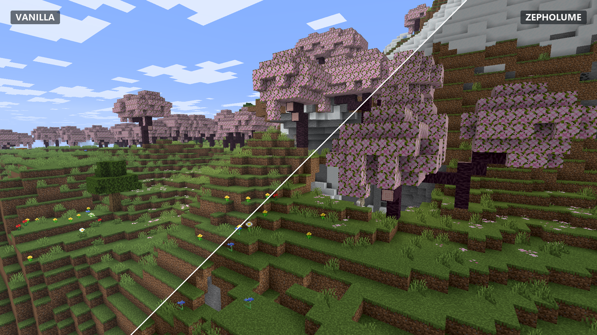

# Zepholume Shaders

**Atmospheric lighting. Polished visuals. Practical performance.**

Zepholume Shaders is a performance-conscious shader pack for **Minecraft Java Edition**. It is built to make Minecraft feel richer, deeper, and more atmospheric without treating frame rate as disposable.



## Current release

**Zepholume Shaders V1.0.1**  
Release archive: `Zepholume-Shaders-1.0.1.zip`

Zepholume requires a compatible shader loader:

- **Iris Shaders** — Fabric ecosystem
- **Oculus** — Forge ecosystem

Minecraft Java **1.20+** versions are the tested support range. Older Minecraft versions may or may not work and are **not guaranteed**.

> OptiFine is not a supported target for Zepholume. Use Iris or Oculus.

## What's new in V1.0.1

V1.0.1 is a refinement release focused on making Zepholume's existing lightweight renderer more cohesive, stable, and useful across its quality tiers rather than bolting on expensive new pipelines.

Highlights include:

- smoother continuous sun-elevation and twilight response across terrain, sky, clouds, and fog
- refined sky/horizon colour, restrained twilight warmth, and improved sun/moon glow
- improved rainy-weather desaturation and dimension-aware fog treatment
- subtle frame-time-driven water animation from **Balanced** upward
- stronger compile-time scaling, including additional analytical sky/cloud work being removed on **Potato**
- redundant shader-work cleanup and safer normalization to reduce invalid-value/NaN risk on malformed or unusual geometry
- continued Iris/Oculus and cross-vendor portability work without adding shadow maps, post-processing chains, temporal buffers, compute stages, or extra heavyweight render targets

No FPS uplift is claimed here without controlled runtime benchmarking. The release keeps performance work evidence-based instead of decorating the changelog with imaginary percentages.

## What Zepholume focuses on

- Atmospheric lighting and environmental colour
- Controlled contrast, exposure, and scene depth
- Refined fog, sky, cloud, weather, and water treatment
- Multiple quality profiles for very different hardware classes
- Stable frame pacing and bounded rendering cost
- A deliberately maintainable shader architecture
- Broad GLSL portability rather than vendor-specific tricks

Zepholume does **not** chase a feature checklist at any cost. The rendering design stays intentionally lean: no shadow-map pipeline, SSR, SSAO, temporal history, volumetric pipeline, ray tracing, compute shaders, geometry shaders, tessellation shaders, or a pile of extra full-resolution colour buffers.

## Quality profiles

| Profile | Best for | Direction |
| --- | --- | --- |
| **Potato** | Very weak or integrated GPUs | Minimum rendering cost; compiles out additional analytical sky/cloud work |
| **Low** | Lower-end hardware | Lightweight environmental treatment |
| **Balanced** | Most players | Recommended visuals/performance balance; enables subtle animated water |
| **High** | Capable gaming GPUs | Stronger bounded atmospheric/material treatment |
| **Ultra** | High-end hardware | Highest bounded Zepholume quality within the same lightweight architecture |

`Balanced` is the recommended starting point. See [Profiles](docs/PROFILES.md) for what each tier changes.

## Installation

1. Install **Iris Shaders** or **Oculus** for your Minecraft version.
2. Download the appropriate Zepholume release.
3. Put the Zepholume `.zip` directly in your Minecraft `shaderpacks` folder.
4. Open Minecraft's shader menu and select **Zepholume Shaders**.
5. Start with the **Balanced** profile, then tune up or down for your hardware.

Full instructions: [Installation Guide](docs/INSTALLATION.md)

## Compatibility

Zepholume is intended for Minecraft Java Edition with **Iris** or **Oculus**.

- **Minecraft 1.20+**: tested support range
- **Older than 1.20**: may work, but not tested or guaranteed
- **Iris**: required/supported shader-loader path
- **Oculus**: required/supported shader-loader path
- **OptiFine**: not a supported target

Compatibility can still vary with Minecraft version, loader version, GPU driver, graphics vendor, and mod combinations. See [Compatibility](docs/COMPATIBILITY.md).

## Documentation

- [Installation](docs/INSTALLATION.md)
- [Compatibility](docs/COMPATIBILITY.md)
- [Quality Profiles](docs/PROFILES.md)
- [Architecture](docs/ARCHITECTURE.md)
- [Troubleshooting](docs/TROUBLESHOOTING.md)
- [Development](docs/DEVELOPMENT.md)
- [Shader source](Zepholume-Shaders/)

## Repository layout

```text
Zepholume-Shaders/
├─ README.md                 Project overview
├─ docs/                     Public project documentation
├─ Screenshots/              Comparison screenshots
├─ Releases/                 Release area
├─ Zepholume-Shaders/        Shader source and development tooling
├─ curseforge-description.html
├─ LICENSE
└─ NOTICE
```

## Design philosophy

A beautiful still image is not enough if moving the camera turns the game into a slideshow. Zepholume treats performance, stability, portability, and maintainability as part of visual quality—not cleanup work for later.

The project therefore prefers bounded analytical effects, shared GLSL libraries, compile-time quality control, and simple rendering paths over architecture cosplay and expensive effects with poor visual return.

## Development status

Zepholume is actively developed. Visual tuning, optimisation, compatibility work, and architectural improvements may continue between releases. Screenshots represent the shader at the time they were captured and can differ slightly from later builds.

## License

Copyright © 2026 Soumyajit Biswas.

Licensed under the [Apache License 2.0](LICENSE).
